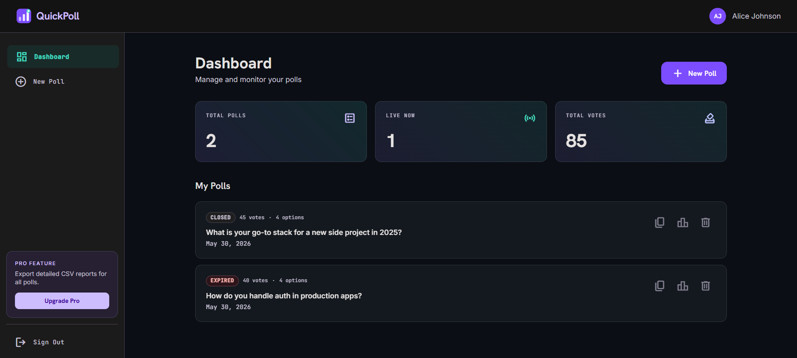
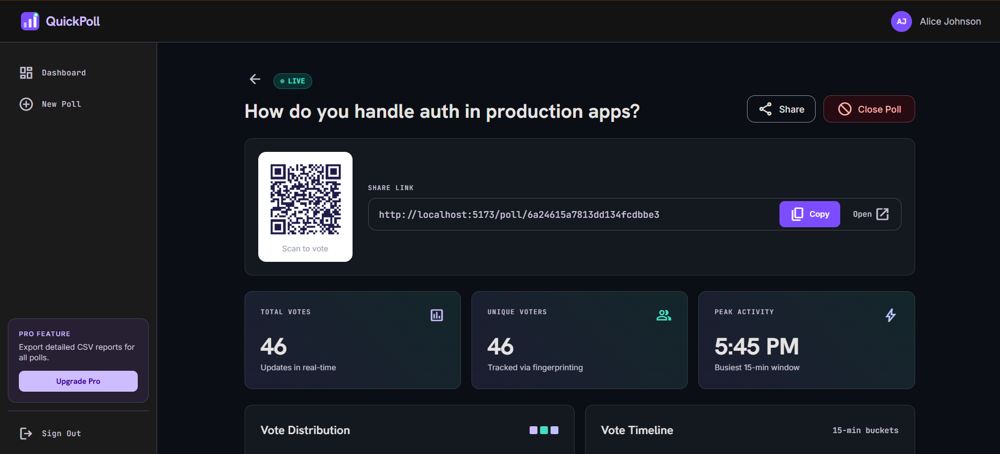
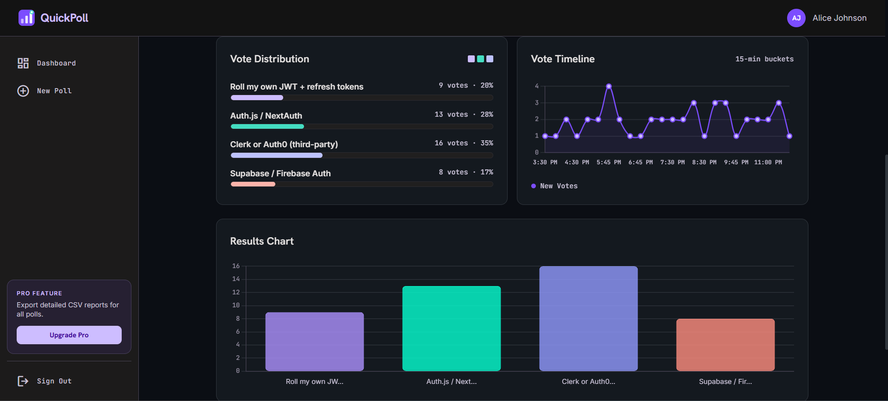
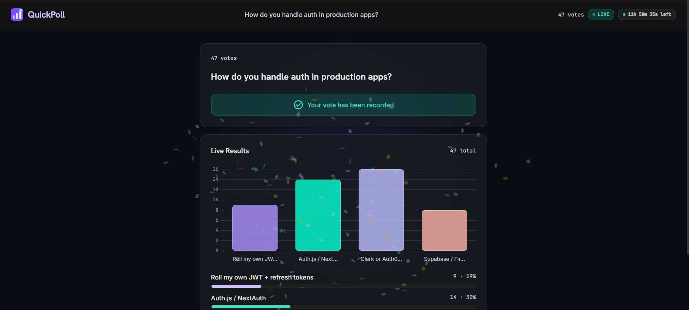

# QuickPoll

A real-time polling app built with the MERN stack, Socket.io, Redis, and BullMQ.

Creators make polls with multiple options and an optional expiry time. Voters open a shared link, vote once (enforced via browser fingerprinting), and see results update live. When a poll expires, a background job auto-closes it and notifies all viewers instantly.

---

## Screenshots

| Dashboard                     | Analytics                     |
| ----------------------------- | ----------------------------- |
|  |  |

| Vote Distribution & Timeline | Live Poll View               |
| ---------------------------- | ---------------------------- |
|    |  |

---

## Tech Stack

| Layer            | Tech                                             |
| ---------------- | ------------------------------------------------ |
| Frontend         | React 19, React Router 7, Tailwind CSS 3, Vite 6 |
| Charts           | Chart.js 4 + react-chartjs-2                     |
| HTTP client      | Axios 1.16                                       |
| Real-time        | Socket.io 4.8 (client + server)                  |
| Backend          | Express 5, Node.js (ESM)                         |
| Database         | MongoDB via Mongoose 9                           |
| Cache / counters | Redis via ioredis 5                              |
| Job queue        | BullMQ 5                                         |
| Auth             | JWT (jsonwebtoken 9) + bcryptjs                  |
| Fingerprinting   | @fingerprintjs/fingerprintjs 4                   |
| UI extras        | canvas-confetti, qrcode                          |

---

## Features

- **Live vote counts** — Redis `HINCRBY` on every vote, broadcast via Socket.io to all viewers in the poll's room
- **Auto-close** — BullMQ delayed job scheduled at poll creation fires at exactly `expiresAt`, closes the poll in MongoDB, and emits `poll-closed` to all clients
- **One vote per user** — browser fingerprint + IP checked against Redis before allowing a vote
- **Confetti on vote** — `canvas-confetti` fires on successful submission
- **QR code sharing** — generated on the analytics page for projector/presentation use
- **Analytics dashboard** — MongoDB `$dateTrunc` aggregation into 15-min buckets, peak activity window, unique voter count
- **Dark UI** — Material Design 3 dark color palette, glass morphism cards, smooth page transitions

---

## Project Structure

```
quickpoll/
├── assets/                         # Screenshots
├── client/
│   └── src/
│       ├── context/AuthContext.jsx
│       ├── utils/
│       │   ├── api.js              # axios + JWT interceptor
│       │   └── socket.js           # singleton socket.io-client
│       ├── pages/
│       │   ├── Login.jsx
│       │   ├── Register.jsx
│       │   ├── Dashboard.jsx
│       │   ├── CreatePoll.jsx
│       │   ├── PollView.jsx        # public voter page
│       │   └── PollAnalytics.jsx   # creator-only stats
│       └── components/
│           ├── Layout.jsx          # sidebar + topnav
│           ├── Logo.jsx            # SVG logo mark
│           ├── PageTransition.jsx  # fade between routes
│           ├── ConfirmModal.jsx    # delete confirmation
│           ├── LiveBarChart.jsx
│           ├── VoteTimelineChart.jsx
│           ├── CountdownTimer.jsx
│           ├── QRCode.jsx
│           └── shared/             # Spinner, EmptyState, ErrorMsg
│
└── server/
    └── src/
        ├── config/
        │   ├── db.js
        │   ├── redis.js
        │   ├── bullmq.js
        │   ├── socket.js           # setIO / getIO (avoids circular deps)
        │   └── features.js         # VOTE_GUARD flag
        ├── models/                 # User, Poll, Vote
        ├── middleware/             # auth (JWT), rateLimiter
        ├── controllers/            # auth, poll, vote
        ├── routes/                 # auth, polls, votes
        ├── socket/pollHandler.js   # join-poll room logic
        ├── workers/pollWorker.js   # BullMQ auto-close worker
        ├── seed.js                 # dev seed (3 users, 8 polls)
        └── index.js
```

---

## Prerequisites

- Node.js 20+
- MongoDB (local or Atlas)
- Redis (local, Upstash, or Redis Cloud)

---

## Setup

### 1. Install

```bash
cd server && npm install
cd ../client && npm install
```

### 2. Environment variables

**`server/.env`**

```env
PORT=5000
MONGODB_URI=mongodb+srv://<user>:<password>@cluster.mongodb.net/quickpoll
JWT_SECRET=your_super_secret_key_minimum_32_characters
JWT_EXPIRY=7d
REDIS_URL=redis://localhost:6379
CLIENT_URL=http://localhost:5173
NODE_ENV=development
```

**`client/.env`**

```env
VITE_API_URL=http://localhost:5000/api
VITE_SOCKET_URL=http://localhost:5000
```

### 3. Run

```bash
# Terminal 1
cd server && npm run dev

# Terminal 2
cd client && npm run dev
```

App → **http://localhost:5173**

### 4. Seed demo data

```bash
cd server && node src/seed.js
```

Creates 3 accounts with 8 realistic polls and sample votes across all of them.

| Email             | Password    |
| ----------------- | ----------- |
| alice@example.com | password123 |
| bob@example.com   | password123 |
| carol@example.com | password123 |

---

## API Reference

### Auth

```
POST /api/auth/register    { name, email, password }
POST /api/auth/login       { email, password }
```

### Polls (JWT required except GET /:id)

```
GET    /api/polls
POST   /api/polls                  { question, options[], expiresAt? }
GET    /api/polls/:id              public
PATCH  /api/polls/:id/close
DELETE /api/polls/:id
GET    /api/polls/:id/analytics    creator only
```

### Votes (no auth)

```
GET  /api/votes/:pollId
POST /api/votes/:pollId    { optionIndex, fingerprint? }
```

---

## Socket.io Events

```
Client → Server:   join-poll   { pollId }
Server → Client:   vote-update { pollId, counts: [{ optionIndex, count }] }
Server → Client:   poll-closed { pollId }
```

---

## How It Works

**Vote cycle:**

1. Voter opens `/poll/:id` → fetches poll + counts in parallel
2. Socket joins the poll's room (`socket.join(pollId)`)
3. Vote POST → MongoDB write + Redis `HINCRBY` + `vote-update` broadcast
4. All clients in room animate their live bar chart

**Poll auto-close:**

1. Poll created with `expiresAt` → `pollExpiryQueue.add('close-poll', { pollId }, { delay })`
2. BullMQ fires at deadline → worker sets `isOpen: false`, emits `poll-closed`
3. All viewers' UI locks instantly

---

## Redis Keys

| Key                             | Type   | Purpose                        |
| ------------------------------- | ------ | ------------------------------ |
| `poll::{pollId}::counts`        | Hash   | Live vote counts per option    |
| `vote::{pollId}::{fingerprint}` | String | Fingerprint dedup (VOTE_GUARD) |
| `vote::{pollId}::{ip}`          | String | IP dedup (VOTE_GUARD)          |

---

## Feature Flags

```js
// server/src/config/features.js
export const FEATURES = {
  VOTE_GUARD: true, // one-vote-per-user via fingerprint + IP
};
```

---

## Security

- Passwords hashed with bcrypt (cost 12)
- JWT verified on every protected request; user re-fetched from DB
- Auth endpoints: 20 req / 15 min
- API endpoints: 100 req / min
- Poll ownership verified server-side before close, delete, and analytics
- `toJSON()` strips password from all User responses
