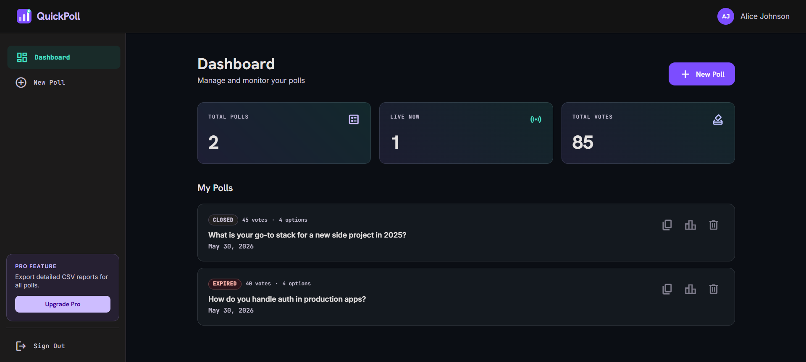
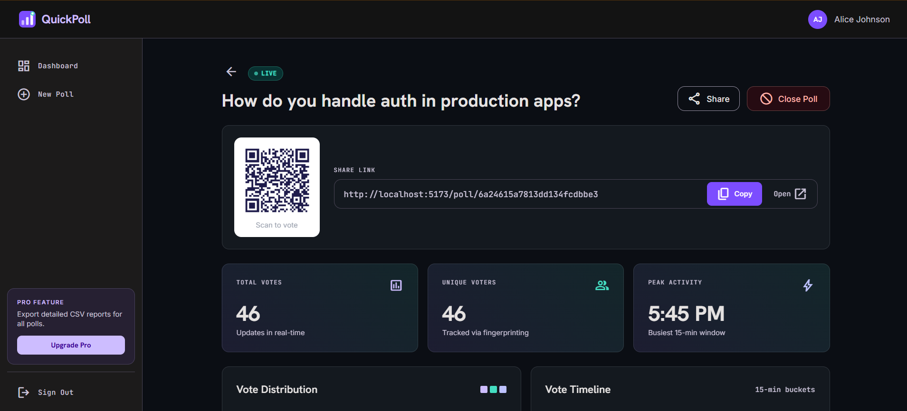
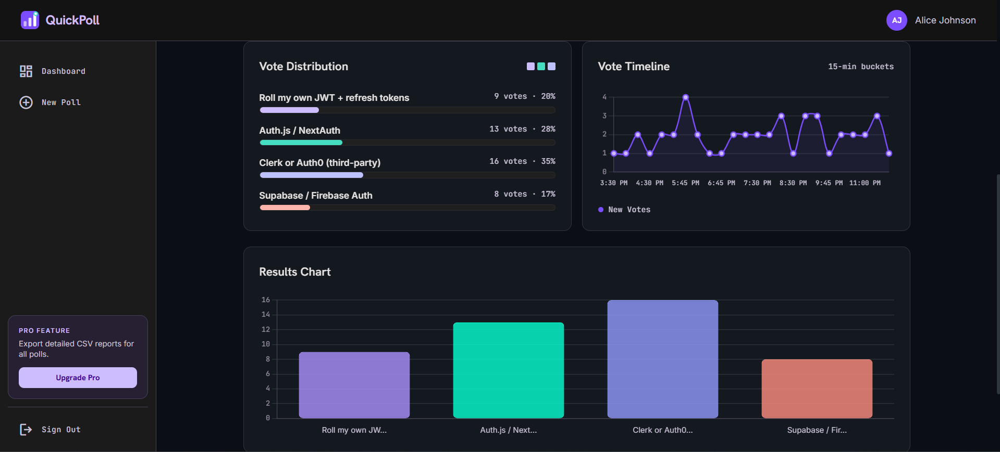
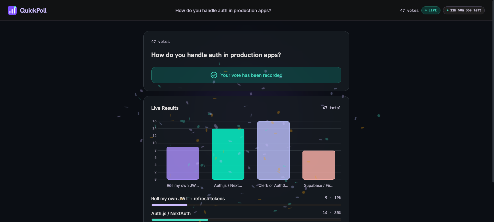

# QuickPoll

A real-time polling app built with the MERN stack, TypeScript, Socket.io, Redis, and BullMQ.

Creators make single-choice, multi-select, or ranked-choice polls with an optional expiry time and can list them on a public Discover page. Voters open a shared link, vote once (enforced via browser fingerprinting), react with emoji, and leave comments — all updating live for every other viewer. When a poll expires, a background job auto-closes it and notifies all viewers instantly.

---

## Screenshots

| Dashboard                     | Analytics                     |
| ----------------------------- | ----------------------------- |
|  |  |

| Vote Distribution & Timeline | Live Poll View               |
| ---------------------------- | ---------------------------- |
|    |  |

---

## Tech Stack

| Layer            | Tech                                                        |
| ----------------- | ------------------------------------------------------------ |
| Frontend         | TypeScript, React 19, React Router 7, Tailwind CSS 3, Vite 6 |
| Charts           | Chart.js 4 + react-chartjs-2                                 |
| Drag & drop      | @dnd-kit (ranked-choice reordering)                          |
| HTTP client      | Axios 1.16                                                   |
| Real-time        | Socket.io 4.8 (client + server), typed event maps            |
| Backend          | TypeScript, Express 5, Node.js (ESM)                         |
| Database         | MongoDB via Mongoose 9                                       |
| Cache / counters | Redis via ioredis 5                                          |
| Job queue        | BullMQ 5                                                     |
| Auth             | JWT (jsonwebtoken 9) + bcryptjs                               |
| Fingerprinting   | @fingerprintjs/fingerprintjs 4                                |
| UI extras        | canvas-confetti, qrcode                                       |

Both `client/` and `server/` are independent TypeScript projects (no shared workspace) — the server compiles with `tsc` to `dist/` for production, and the client build runs a full `tsc --noEmit` type-check before `vite build`.

---

## Features

- **Three poll types** — single-choice, multi-select (pick several), and ranked-choice (drag to rank every option; results tallied via instant-runoff voting, with a round-by-round breakdown)
- **Live vote counts** — Redis `HINCRBY` on every vote, broadcast via Socket.io to all viewers in the poll's room; a dedicated ballots counter keeps "total votes" accurate for multi-select polls
- **Public Discover page** — creators can opt a poll into a public, paginated `/discover` feed sorted by recency or popularity
- **Comments & reactions** — anonymous discussion threads and a fixed emoji-reaction bar per poll, both broadcasting live over the poll's socket room and rate-limited/dedup'd the same way voting is
- **Auto-close** — BullMQ delayed job scheduled at poll creation fires at exactly `expiresAt`, closes the poll in MongoDB (caching the final instant-runoff result for ranked polls), and emits `poll-closed` to all clients
- **One vote/reaction per user** — browser fingerprint + IP checked against Redis before allowing a vote or a repeat reaction
- **Confetti on vote** — `canvas-confetti` fires on successful submission
- **QR code sharing** — generated on the analytics page for projector/presentation use
- **Analytics dashboard** — MongoDB `$dateTrunc` aggregation into 15-min buckets, peak activity window, unique voter count, instant-runoff rounds for ranked polls
- **Dark UI** — Material Design 3 dark color palette, glass morphism cards, smooth page transitions, skeleton loading states, toast notifications

---

## Project Structure

```
quickpoll/
├── assets/                         # Screenshots
├── client/
│   └── src/
│       ├── types/                  # api.ts (DTOs), socket.ts (event maps)
│       ├── context/
│       │   ├── AuthContext.tsx
│       │   └── ToastContext.tsx
│       ├── utils/
│       │   ├── api.ts              # axios + JWT interceptor
│       │   ├── socket.ts           # singleton, typed socket.io-client
│       │   └── chartTheme.ts       # Chart.js colors mirroring Tailwind palette
│       ├── pages/
│       │   ├── Login.tsx
│       │   ├── Register.tsx
│       │   ├── Dashboard.tsx
│       │   ├── CreatePoll.tsx
│       │   ├── PollView.tsx        # public voter page
│       │   ├── PollAnalytics.tsx   # creator-only stats
│       │   └── PollDiscovery.tsx   # public poll browsing
│       └── components/
│           ├── Layout.tsx          # sidebar + topnav
│           ├── Logo.tsx            # SVG logo mark
│           ├── PageTransition.tsx  # fade between routes
│           ├── ConfirmModal.tsx    # delete confirmation
│           ├── LiveBarChart.tsx
│           ├── VoteTimelineChart.tsx
│           ├── IrvRoundsChart.tsx  # ranked-choice round breakdown
│           ├── RankedChoiceVoter.tsx  # @dnd-kit drag-to-rank UI
│           ├── ReactionBar.tsx
│           ├── CommentSection.tsx
│           ├── CountdownTimer.tsx
│           ├── QRCode.tsx
│           └── shared/             # Spinner, EmptyState, ErrorMsg, ErrorState, SkeletonCard
│
└── server/
    └── src/
        ├── types/                  # models.ts, socket.ts, express.d.ts
        ├── config/
        │   ├── db.ts
        │   ├── redis.ts
        │   ├── bullmq.ts
        │   ├── socket.ts           # setIO / getIO (avoids circular deps)
        │   └── features.ts         # VOTE_GUARD flag, reaction emoji palette
        ├── models/                 # User, Poll, Vote, Comment, Reaction
        ├── middleware/             # auth (JWT), rateLimiter
        ├── controllers/            # auth, poll, vote, comment, reaction
        ├── routes/                 # auth, polls (incl. discover/comments/reactions), votes
        ├── socket/pollHandler.ts   # join-poll room logic
        ├── workers/pollWorker.ts   # BullMQ auto-close worker
        ├── utils/irv.ts            # instant-runoff tallying (unit tested)
        ├── demo/                   # demo data: content.ts (poll specs), generate.ts (seeded builder)
        ├── seed.ts                 # npm run seed — wipe + load demo data
        └── index.ts
```

---

## Prerequisites

- Node.js 20+
- MongoDB (local or Atlas)
- Redis (local, Upstash, or Redis Cloud)

---

## Setup

### 1. Install

```bash
cd server && npm install
cd ../client && npm install
```

### 2. Environment variables

**`server/.env`**

```env
PORT=5000
MONGODB_URI=mongodb+srv://<user>:<password>@cluster.mongodb.net/quickpoll
JWT_SECRET=your_super_secret_key_minimum_32_characters
JWT_EXPIRY=7d
REDIS_URL=redis://localhost:6379
CLIENT_URL=http://localhost:5173
NODE_ENV=development
```

**`client/.env`**

```env
VITE_API_URL=http://localhost:5000/api
VITE_SOCKET_URL=http://localhost:5000
```

### 3. Run (development)

```bash
# Terminal 1
cd server && npm run dev      # tsx watch — no build step needed in dev

# Terminal 2
cd client && npm run dev
```

App → **http://localhost:5173**

### 4. Build & run (production)

```bash
cd server && npm run build && npm start   # compiles to dist/, then runs it
cd client && npm run build                # tsc --noEmit && vite build → client/dist/
```

### 5. Seed demo data

```bash
cd server && npm run seed
```

Loads 5 accounts and 20 polls with ~900 votes, ~50 comments and ~550 reactions. The mix covers single, multi-select and ranked-choice polls; live, expiring, manually closed and auto-expired states; public (Discover) and private polls; and one brand-new poll with no votes. Vote timelines spike at launch and taper off, and the pizza poll is built so the first-round leader loses the instant runoff. Generation is deterministic (seeded PRNG), and poll content lives in `server/src/demo/content.ts`. `npm run seed` wipes existing data first.

The server also seeds this demo data automatically on startup when the database has no users, so a fresh deployment isn't empty. Existing data is never touched; set `SEED_DEMO_DATA=false` to disable it.

| Email             | Password    |
| ----------------- | ----------- |
| alice@example.com | password123 |
| bob@example.com   | password123 |
| carol@example.com | password123 |
| priya@example.com | password123 |
| marcus@example.com | password123 |

### 6. Run server tests

```bash
cd server && npm test   # node:test — covers the instant-runoff (irv.ts) algorithm
```

---

## API Reference

### Auth

```
POST /api/auth/register    { name, email, password }
POST /api/auth/login       { email, password }
```

### Polls (JWT required except where noted)

```
GET    /api/polls/discover         public — ?page=&limit=&sort=recent|popular
GET    /api/polls/:id              public
GET    /api/polls                  creator's own polls
POST   /api/polls                  { question, options[], pollType?, isPublic?, expiresAt? }
PATCH  /api/polls/:id/close
DELETE /api/polls/:id
GET    /api/polls/:id/analytics    creator only
```

`pollType` is `'single' | 'multi' | 'ranked'` (default `'single'`).

### Comments (nested under polls)

```
GET    /api/polls/:id/comments               public — ?page=&limit=
POST   /api/polls/:id/comments                public — { authorName, body }
DELETE /api/polls/:id/comments/:commentId     creator only
```

### Reactions (nested under polls)

```
GET  /api/polls/:id/reactions      public
POST /api/polls/:id/reactions      public — { emoji, fingerprint? }
```

### Votes (no auth)

```
GET  /api/votes/:pollId
POST /api/votes/:pollId    { optionIndex, fingerprint? }             — single
POST /api/votes/:pollId    { optionIndexes: number[], fingerprint? } — multi
POST /api/votes/:pollId    { rankings: number[], fingerprint? }      — ranked, full permutation of every option index
```

---

## Socket.io Events

```
Client → Server:   join-poll       { pollId }
Server → Client:   vote-update     { pollId, counts: [{ optionIndex, count }], totalVotes }
Server → Client:   poll-closed     { pollId, finalResult?: { winnerIndex, rounds } }
Server → Client:   comment-added   { _id, pollId, authorName, body, createdAt }
Server → Client:   reaction-update { pollId, reactions: [{ emoji, count }] }
```

---

## How It Works

**Vote cycle:**

1. Voter opens `/poll/:id` → fetches poll (including live counts + `totalVotes`)
2. Socket joins the poll's room (`socket.join(pollId)`)
3. Vote POST → MongoDB write + Redis `HINCRBY` per selected option + a ballots counter + `vote-update` broadcast
4. All clients in room animate their live bar chart

**Ranked-choice tallying:**

1. Each ballot is stored as a full ranking (`rankings: number[]`) in MongoDB; the first preference also feeds the normal Redis live-count path while the poll is open
2. `utils/irv.ts` computes an instant-runoff result (round-by-round elimination) from the stored ballots — on demand for analytics, and once at close time
3. The result is cached on `Poll.finalResult` so the public poll page can show the authoritative outcome without recomputation

**Poll auto-close:**

1. Poll created with `expiresAt` → `pollExpiryQueue.add('close-poll', { pollId }, { delay })`
2. BullMQ fires at deadline → shared `finalizePollClose` sets `isOpen: false` (computing/caching the IRV result for ranked polls), emits `poll-closed`
3. All viewers' UI locks instantly — the same code path runs for manual closes via `PATCH /api/polls/:id/close`

---

## Redis Keys

| Key                                  | Type   | Purpose                              |
| ------------------------------------- | ------ | ------------------------------------- |
| `poll::{pollId}::counts`              | Hash   | Live vote counts per option           |
| `poll::{pollId}::ballots`             | String | True ballot count (multi-select safe) |
| `poll::{pollId}::reactions`           | Hash   | Live reaction counts per emoji        |
| `vote::{pollId}::{fingerprint}`       | String | Fingerprint dedup (VOTE_GUARD)        |
| `vote::{pollId}::{ip}`                | String | IP dedup (VOTE_GUARD)                 |
| `reaction::{pollId}::{emoji}::{fp}`   | String | Per-emoji fingerprint dedup           |
| `reaction::{pollId}::{emoji}::{ip}`   | String | Per-emoji IP dedup                    |

---

## Feature Flags

```ts
// server/src/config/features.ts
export const FEATURES = {
  VOTE_GUARD: true, // one-vote-per-user via fingerprint + IP (also gates reaction dedup)
};

export const REACTION_EMOJIS = ['👍', '🎉', '🤔', '❤️', '😂'] as const;
```

---

## Security

- Passwords hashed with bcrypt (cost 12)
- JWT verified on every protected request; user re-fetched from DB
- Auth endpoints: 20 req / 15 min
- API endpoints: 100 req / min; comment posting: 10 req / min
- Poll ownership verified server-side before close, delete, analytics, and comment moderation
- `toJSON()` strips password from all User responses
